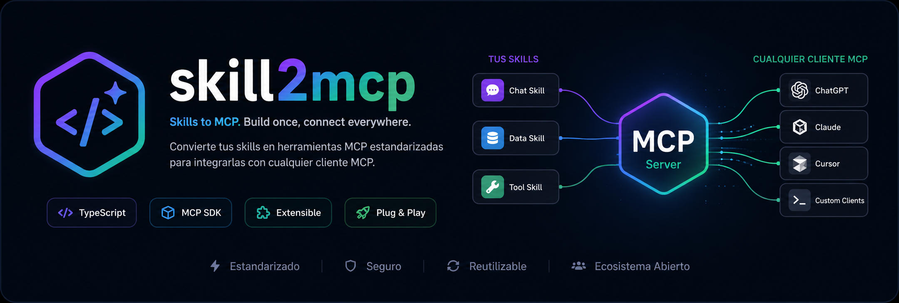

# skill2mcp



`skill2mcp` is a TypeScript CLI/library that converts `SKILL.md` documents into MCP-ready tool definitions and can generate a minimal deployable MCP Server package from a single file or an entire skills directory.

The generated server uses the official MCP TypeScript SDK (`@modelcontextprotocol/sdk`) and supports `stdio`, `http`, or `both` transports.

## Why this project

SKILL documents are usually semi-structured markdown (frontmatter + prose + tables). MCP tools require strict contracts (`name`, `description`, `inputSchema`).

`skill2mcp` bridges that gap with a layered pipeline:

1. Parse markdown into a stable Intermediate Representation (IR)
2. Transform IR into MCP tool definitions
3. Generate a deployable MCP server package with handler stubs

## Current status

MVP implemented and working:

- Deterministic parser (`strict`, `tolerant`)
- Cascading semantic mode (`semantic`) for missing metadata fallback
- Tool transformation (`SchemaBuilder`, `ToolMapper`, `ToolValidator`)
- `inspect` output with MCP-style tool JSON
- `build` output with deployable MCP server package
- Generated server supports `stdio` + `http`
- `build --watch` for iterative regeneration

## Installation

### Requirements

- Node.js 20+
- npm 10+

### Local install

```bash
npm install
```

### Build CLI

```bash
npm run build
```

## Quick start

### 1. Parse a single SKILL

```bash
npm run parse -- ./fixtures/skills/valid-skill.md --mode strict
```

### 2. Inspect generated tool definitions

```bash
npm run inspect -- ./fixtures/skills --mode tolerant
```

### 3. Generate deployable MCP server package

```bash
npm run gen -- ./fixtures/skills --out ./generated/mcp-server --transport both --mode tolerant
```

### 4. Run generated server

```bash
cd ./generated/mcp-server
npm install
npm run build
npm run start:stdio
# or
npm run start:http
```

HTTP endpoint:

```text
POST /mcp
```

## CLI reference

### `parse`

Converts SKILL markdown to IR JSON.

```bash
skill2mcp parse <input> [--mode strict|tolerant|semantic]
```

Arguments:

- `<input>`: path to a `.md` file or directory

Options:

- `--mode`: parser mode (`tolerant` default)
- `--format`: currently `json`

Output:

- `results[]` with parsed `SkillDocument`
- `diagnostics[]` per source file

### `inspect`

Converts parsed IR into MCP-like tool definitions.

```bash
skill2mcp inspect <input> [--mode strict|tolerant|semantic]
```

Output:

- `tools[]`: generated tool definitions (`name`, `description`, `inputSchema`)
- `results[]`: tool + diagnostics per source

### `build`

Generates a deployable MCP server package from one or many skills.

```bash
skill2mcp build <input> --out <dir> [--transport stdio|http|both] [--mode strict|tolerant|semantic] [--watch]
```

Arguments:

- `<input>`: path to a `.md` file or directory

Required options:

- `--out`: output directory for generated package

Optional options:

- `--transport`: default generated server transport (`both` default)
- `--mode`: parsing mode (`tolerant` default)
- `--watch`: regenerate package on source changes

Output:

- generated package files (`package.json`, `tools.json`, `src/server.ts`, handlers)
- diagnostics summary in JSON

## Parse modes

### `strict`

- Fails on required metadata/schema gaps
- Best for CI quality gates

### `tolerant`

- Continues with warnings for missing fields
- Best for batch processing mixed-quality skills

### `semantic`

- Starts from tolerant parse
- Attempts semantic extraction through OpenRouter (when configured)
- Applies deterministic fallback inference for unresolved fields
- Keeps diagnostics trace (`SEMANTIC_*` codes)

### OpenRouter configuration for `semantic`

Environment variables:

- `OPENROUTER_API_KEY`: enables remote semantic extraction
- `OPENROUTER_MODEL` (optional): defaults to `anthropic/claude-3.5-sonnet`
- `SKILL2MCP_CACHE_DIR` (optional): override cache directory
- `OPENROUTER_HTTP_REFERER` (optional): forwarded as OpenRouter header
- `OPENROUTER_X_TITLE` (optional): forwarded as OpenRouter header

Cache behavior:

- Semantic responses are cached by content hash in `.skill2mcp-cache/semantic-openrouter-cache.json`
- If cache is present, semantic mode reuses cache and avoids extra remote calls

## Canonical `SKILL.md` format (recommended)

```md
---
name: docx-generator
version: 1.0.0
description: Generate Word docs from structured markdown
tags: [documents, office]
---

## Parameters
| Name | Type | Required | Default | Description |
|------|------|----------|---------|-------------|
| content | string | yes |  | Markdown content |
| title | string | yes |  | Document title |

## Examples
**Input:** `{ content: "# Hello", title: "Report" }`
**Output:** report.docx generated at /outputs/

## Triggers
- "generate document"
- "create report"
```

## Generated package structure

```text
generated/mcp-server/
  package.json
  tsconfig.json
  README.md
  tools.json
  src/
    server.ts
    generated-tools.ts
    handlers/
      index.ts
      <tool_name>.ts
```

## Development

### Scripts

```bash
npm run build       # compile TypeScript
npm run test        # run test suite
npm run parse       # parse command entry
npm run inspect     # inspect command entry
npm run gen         # build command entry
```

### Test suite

Current automated coverage includes:

- parser behavior (`strict`, `tolerant`, `semantic`)
- schema builder and tool mapping
- inspect command output contract
- end-to-end build artifact generation

## Engineering conventions

- Follow repository collaboration rules in `AGENTS.md`
- Product/business directives are governed by `ROADMAP.md`
- Commit messages must use `[AI]` prefix when AI-generated

## Release artifacts

This repo includes:

- Dual-license distribution: `MIT OR Apache-2.0`
- `CHANGELOG.md`
- `CONTRIBUTING.md`
- `RELEASE_CHECKLIST.md`

## Collaboration model

- Governance and decision rules: `GOVERNANCE.md`
- Code of conduct: `CODE_OF_CONDUCT.md`
- Security reporting: `SECURITY.md`
- Support channels: `SUPPORT.md`

## Known limitations

- Parameter parsing currently assumes markdown table format in `## Parameters`
- Semantic mode prioritizes missing metadata and may enrich missing parameters when extraction is available
- Watch mode tracks current tree; if deeply nested folders are added later, restart watch for complete coverage

## Roadmap alignment

The active implementation follows phased delivery in `ROADMAP.md`.

GenAI integration policy (when enabled) prioritizes OpenRouter as default provider strategy, as defined in roadmap directives.

## License

Licensed under either of:

- MIT License (`LICENSE-MIT`)
- Apache License 2.0 (`LICENSE-APACHE`)

at your option.
